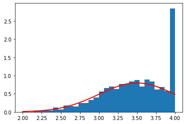
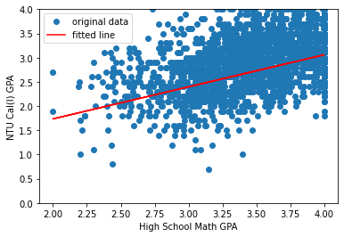

# Management Math 110-2 / Homework 02
### B10705047 邱秉辰


## Question 1
### 1(a)

We use the following function to generate `hs_math_gpa` :
`random.Generator.normal(loc=3.5, scale=0.5, size=n)`

**Parameters**
- `loc` : float or array_like of floats
  - Mean (“centre”) of the distribution.
- `scale` : float or array_like of floats
  - Standard deviation (spread or “width”) of the distribution. Must be non-negative.
- `size` : 
  - int or tuple of ints, optional

**Returns**
- out : ndarray or scalar


```python
import numpy as np
import random
np.random.seed(1234)
n = 2000 #number of calculus students in NTU

#Generating HS GPA
hs_math_gpa = np.random.normal(loc = 3.5, scale = 0.5, size = n)
```


```python
# truncate to 2.0 - 4.0
for i in range(2000):
    if hs_math_gpa[i] < 2.0:
        hs_math_gpa[i] = 2
    elif hs_math_gpa[i] > 4.0:
        hs_math_gpa[i] = 4

print(hs_math_gpa)
```

    [3.73571758 2.90451215 4.         ... 3.89073145 4.         3.04582473]


Then we plot of the graph of the normal distribution using the `matplotlib.pyplot`


```python
import matplotlib.pyplot as plt
sigma = 0.5
count, bins, ignored = plt.hist(hs_math_gpa, 30, density=True)
plt.plot(bins, 1/(sigma * np.sqrt(2 * np.pi)) *
               np.exp( - (bins - 3.5)**2 / (2 * sigma**2) ),
         linewidth=2, color='r')
plt.show()
```


    

    


Next up, we generate the independent variable 2 and 3

We will apply the following function :

`random.Generator.binomial(n, p, size=None)`

Samples are drawn from a **binomial distribution** with specified parameters, $n$ trials and $p$ probability of success where $n$ an integer $>= 0$ and $p$ is in the interval $[0,1]$. ($n$ may be input as a float, but it is truncated to an integer in use)


```python
# Determine the possibility of hs_calculus
for i in hs_math_gpa:
    p = 0.75 if i >= 3.6 else 0.4
hs_calculus = np.random.binomial(1, p , size = n)
print(hs_calculus)

for i in hs_calculus:
    p = 0.6 if i == 0 else 0.25
ntu_precalc = np.random.binomial(1, p , size = n)
print(ntu_precalc)

```

    [1 0 1 ... 0 1 0]
    [0 1 1 ... 1 1 1]


Then we generate the dependent variable, by the formula given in the problem statement


```python
ntu_calculus_gpa = 0.3 + 0.7*hs_math_gpa + 0.3*hs_calculus  + 0.1*ntu_precalc  + np.random.normal(loc = 0, scale = 0.5, size = n)
# nearest 0.1
ntu_calculus_gpa = np.round_(ntu_calculus_gpa, decimals = 1)
# truncate under 0.7 or over 4.0
for i in range(2000):
    if ntu_calculus_gpa[i] > 4.0: ntu_calculus_gpa[i] = 4.0
    elif ntu_calculus_gpa[i] < 0: ntu_calculus_gpa[i] = 0.0
    elif ntu_calculus_gpa[i] < 0.7: ntu_calculus_gpa[i] = 0.7

```

We print out table  with first - 20 independent and dependent variables

Reference: https://geek-docs.com/python/python-tutorial/python-prettytable.html


```python
from prettytable import PrettyTable
x = PrettyTable()
x.field_names = ["hs_math_gpa", "hs_calculus", "ntu_precalc", "ntu_calculus_gpa"]
for i in range(20):
    x.add_row([hs_math_gpa[i], hs_calculus[i], ntu_precalc[i], ntu_calculus_gpa[i]])
print(x)
```

    +--------------------+-------------+-------------+------------------+
    |    hs_math_gpa     | hs_calculus | ntu_precalc | ntu_calculus_gpa |
    +--------------------+-------------+-------------+------------------+
    | 3.7357175818662465 |      1      |      0      |       2.8        |
    | 2.9045121526467677 |      0      |      1      |       2.8        |
    |        4.0         |      1      |      1      |       3.5        |
    | 3.3436740519541437 |      0      |      0      |       2.4        |
    | 3.139705633317494  |      1      |      1      |       3.0        |
    | 3.943581470153869  |      1      |      0      |       3.2        |
    | 3.929794206858708  |      0      |      1      |       2.4        |
    | 3.1817382477913254 |      1      |      0      |       2.3        |
    | 3.5078481860572146 |      1      |      0      |       3.0        |
    | 2.3786575229072975 |      1      |      1      |       3.1        |
    |        4.0         |      1      |      1      |       3.6        |
    | 3.9959730111713387 |      0      |      0      |       4.0        |
    | 3.976662064056215  |      0      |      0      |       3.8        |
    | 2.4893725899025148 |      0      |      1      |       2.0        |
    | 3.3329613170959513 |      1      |      0      |       3.4        |
    | 3.501059182341743  |      1      |      1      |       3.4        |
    | 3.7027267057850954 |      1      |      0      |       2.3        |
    | 3.6445459704900176 |      0      |      1      |       2.3        |
    |        4.0         |      0      |      1      |       2.9        |
    |  2.72654722338538  |      0      |      1      |       2.2        |
    +--------------------+-------------+-------------+------------------+


### 1(b)
We proceed the linear regression process by using `LinearRegression in sklearn.linear_model ` 

Reference: https://scikit-learn.org/

- $X$ is an 2D array (size: $2000\times3$ ) which represents the independent variables.
- `reg` is the model we attained by Linear Regression
  - We aquire the coefficients through `reg.coef_` (which is actually an numpy array)
  - We acquire the intercept through `reg.intercept_` (which is actually a scalar)


```python
from sklearn.linear_model import LinearRegression
X = np.zeros((2000,3))
for i in range(2000):
    X[i][0] = hs_math_gpa[i]
    X[i][1] = hs_calculus[i]
    X[i][2] = ntu_precalc[i]

reg = LinearRegression().fit(X, ntu_calculus_gpa)
print("Coefficient: ",reg.coef_)
print("Intercept: ",reg.intercept_)

```

    Coefficient:  [0.66174575 0.33556036 0.10170856]
    Intercept:  0.4125153753434483


We sketch the graph of `ntu_calculus_gpa` w.r.t. `hs_math_gpa` using the `matplotlib.pyplot`


```python
plt.plot(hs_math_gpa, ntu_calculus_gpa , 'o', label='original data')
plt.plot(hs_math_gpa, reg.intercept_ + reg.coef_[0]*hs_math_gpa, 'r', label='fitted line')
plt.xlabel('High School Math GPA')
plt.ylabel('NTU Cal(I) GPA')
plt.ylim(0,4.0)
plt.legend()
plt.show()
```


    

    


### 1(c)
We will setup the matrix $X$ and $y$ where $X$ is intercept plus independent variables and $y$ is dependent variable, noted that $X$ is also called **a design matrix**


```python
#Setting up X
print("The matrix X:")
X = np.array([np.full((2000,),1),hs_math_gpa, hs_calculus, ntu_precalc ]).T
print(X, end = "\n\n")

#Setting up Y
y = np.array(ntu_calculus_gpa)
print("The matrix y:")
print(y)
```

    The matrix X:
    [[1.         3.73571758 1.         0.        ]
     [1.         2.90451215 0.         1.        ]
     [1.         4.         1.         1.        ]
     ...
     [1.         3.89073145 0.         1.        ]
     [1.         4.         1.         1.        ]
     [1.         3.04582473 0.         1.        ]]
    
    The matrix y:
    [2.8 2.8 3.5 ... 2.8 3.8 2.7]


### 1(d)


1. We use `numpy.linalg.inv()` to obtain the inverse matrix
2. We use `np.dot()` to proceed matrix multiplication
3. We use `np.linalg.det()` to calculate the determinant
4. By the following properties, we can use the result obtained by 1. to 3. to obtain the adjoint matrix

$$ A^{-1} = \frac{1}{det(A)} adjA $$
$$ \implies adj A = A^{-1} \times det(A)$$


```python
from numpy.linalg import inv
A = inv(np.dot(X.T,X))
print("A = \n",A)

C = np.dot(X.T,X)
print("C = \n", C)

# Find adj(C)
adjC = inv(np.dot(X.T,X)) * np.linalg.det(C)
print("adjC = \n", adjC)

# Find det(C)
detC = np.linalg.det(C)
print("detC = \n", detC)

```

    A = 
     [[ 3.56957936e-02 -9.85105586e-03 -8.37083915e-04 -1.10369237e-03]
     [-9.85105586e-03  2.84792755e-03 -5.96584633e-06 -5.18049562e-05]
     [-8.37083915e-04 -5.96584633e-06  2.08229258e-03  3.76405105e-05]
     [-1.10369237e-03 -5.18049562e-05  3.76405105e-05  2.09480980e-03]]
    C = 
     [[ 2000.          6941.76090265   802.          1211.        ]
     [ 6941.76090265 24445.314274    2784.49582341  4211.90846331]
     [  802.          2784.49582341   802.           477.        ]
     [ 1211.          4211.90846331   477.          1211.        ]]
    adjC = 
     [[ 5.75135408e+09 -1.58721532e+09 -1.34872082e+08 -1.77828393e+08]
     [-1.58721532e+09  4.58861902e+08 -9.61225153e+05 -8.34688394e+06]
     [-1.34872082e+08 -9.61225153e+05  3.35501770e+08  6.06468947e+06]
     [-1.77828393e+08 -8.34688394e+06  6.06468947e+06  3.37518561e+08]]
    detC = 
     161121339535.36957


For future uses, we define $A = (X^{T}X)^{-1}$

### 1(e)

1. $\hat\beta = A^{-1}X^Ty$, we declare  $\hat\beta$ as `betaHat` 
2. $\text{residuals} = y - X\cdot\hat\beta$
3. $\text{residual variance} =  \frac{\sum\text{residuals}^2}{n - p -1}$, where $p = 3$
4. $\hat{Var}(\hat\beta) = \text{residual variance} \cdot A  $, we declare $\hat{Var}(\hat\beta)$ as  `beta_covar`


```python

betaHat = np.dot(np.dot(A,X.T), y)
print("betaHat: \n",betaHat)

residuals = y - np.dot(X, betaHat)
print("residuals: \n",residuals)

residual_var = sum(residuals**2)/ (n - 4)
print("residual_var: \n",residual_var)

beta_covar = residual_var * A
print("beta_covar: \n",beta_covar)


```

    betaHat: 
     [0.41251538 0.66174575 0.33556036 0.10170856]
    residuals: 
     [-0.42017097  0.36372749  0.00323271 ... -0.28889893  0.30323271
      0.17021449]
    residual_var: 
     0.23065827576776018
    beta_covar: 
     [[ 8.23353020e-03 -2.27222756e-03 -1.93080332e-04 -2.54575779e-04]
     [-2.27222756e-03  6.56898059e-04 -1.37607183e-06 -1.19492419e-05]
     [-1.93080332e-04 -1.37607183e-06  4.80298017e-04  8.68209524e-06]
     [-2.54575779e-04 -1.19492419e-05  8.68209524e-06  4.83185217e-04]]


### 1(f)
We use `PrettyTable` to establish the table with different sets of coefficients.
- In the list `truth`, we have the true values of the coefficients.
- The list `cata` will be the first column of the table that show us the catagories of the coefficients (or just intercept)
- `reg_arr` is a combination of `reg.intercept_` and `reg.coef_`, the type of `reg_arr` is numpy array.
- We set the heading row by `tb1.field_names`.
- Finally, we use for loop to add each row into the table, then print the table directly. 


```python
tb1 = PrettyTable()
cata = ["Intercept", "High School Math GPA", "High School Calculus", "NTU Precalculus"]
truth = [0.3, 0.7, 0.3, 0.1]
tb1.field_names = ["Catagories","Truth", "Manual", "lm"]
reg_arr = np.array([reg.intercept_] + list(reg.coef_))
for i in range(4):
     tb1.add_row([cata[i] , truth[i], betaHat[i], reg_arr[i]])
print(tb1)

```

    +----------------------+-------+---------------------+---------------------+
    |      Catagories      | Truth |        Manual       |          lm         |
    +----------------------+-------+---------------------+---------------------+
    |      Intercept       |  0.3  | 0.41251537534341254 |  0.4125153753434483 |
    | High School Math GPA |  0.7  |  0.6617457506746851 |  0.6617457506746908 |
    | High School Calculus |  0.3  |  0.3355603604672041 | 0.33556036046720594 |
    |   NTU Precalculus    |  0.1  | 0.10170855548199395 | 0.10170855548199562 |
    +----------------------+-------+---------------------+---------------------+


#### Observation
The value of intercept and coefficients acquired by manual or `lm()` are **nearly the same**

### 1(g)
We can get the standard errors by taking the **square root** of **the diagonal** of  `xxx_covar`


```python
#manual SE
beta_SE = (np.diag(beta_covar))**0.5

#lm SE
lm_residuals = y - reg.predict(X[:,1:])
lm_residual_var = sum(lm_residuals**2)/ (n - 4)
lm_covar = lm_residual_var * A
lm_SE = (np.diag(lm_covar))**0.5

#True SE
true_covar = 0.25 * A
true_SE = (np.diag(true_covar))**0.5

```

Then, we print the table of different Standard Errors by `PrettyTable`


```python
tbSE = PrettyTable()
cata = ["Intercept", "High School Math GPA", "High School Calculus", "NTU Precalculus"]
tbSE.field_names = ["Catagories","Truth", "Manual", "lm"]
for i in range(4):
     tbSE.add_row([cata[i] ,true_SE[i] , beta_SE[i], lm_SE[i]])
print(tbSE)
```

    +----------------------+----------------------+----------------------+----------------------+
    |      Catagories      |        Truth         |        Manual        |          lm          |
    +----------------------+----------------------+----------------------+----------------------+
    |      Intercept       | 0.09446665230258339  | 0.09073880207170049  |  0.0907388020717005  |
    | High School Math GPA | 0.026682988735879803 |  0.0256300226013217  | 0.025630022601321703 |
    | High School Calculus | 0.02281607208536135  | 0.021915702510298837 | 0.02191570251029884  |
    |   NTU Precalculus    | 0.022884546105102738 | 0.021981474403055933 | 0.02198147440305594  |
    +----------------------+----------------------+----------------------+----------------------+


#### Observation
The Standard Errors generated by manual and `lm()` are **nearly the same**

### 1(h)
We use `PrettyTable` to print out the residual variance calculated previously respectively.


```python
tb2 = PrettyTable()
tb2.field_names = [" ","Truth", "Manual", "lm"]
tb2.add_row(["Residual Var Est.",0.25, residual_var, lm_residual_var])
print(tb2)
```

    +-------------------+-------+---------------------+--------------------+
    |                   | Truth |        Manual       |         lm         |
    +-------------------+-------+---------------------+--------------------+
    | Residual Var Est. |  0.25 | 0.23065827576776018 | 0.2306582757677603 |
    +-------------------+-------+---------------------+--------------------+


#### Observation
The residual variance generated by manual and `lm()` are **nearly the same**

### 1(i)

Firstly, we construct an array `stuX` to store the data of the student. The first element is 1 since it is always "one" times the intercept, then we put HS_math_GPA = 3.123456, HS_calculus = 1, and NTU_precalculus = 0.

Recall that  the vector ` truth = [0.3, 0.7, 0.3, 0.1] `, then by the formula provided by the problem statement, we can calculate the actual GPA by
$$ GPA_{truth} = stuX \cdot truth $$ 


where `stuX` and `truth` are seen as 2D vectors here.

Then, we calculate the predicted GPA w.r.t. the intercept and the coefficients obtained by manual linear regression method. We therefore substitute `truth` for `betaHat`.

Finally, we calculate the predicted GPA w.r.t. the intercept and the coefficients obtained by `lm` method. We substitute `truth`(or `betaHat`) for `regArr`.


```python
stuX = np.array([1, 3.123456, 1, 0])

#Truth
truth_gpa = np.dot(stuX, truth)  + np.random.normal(loc = 0, scale = 0.5)
#Manual
maunal_gpa = np.dot(stuX, betaHat)
#lm
lm_gpa = np.dot(stuX, reg_arr)
```

We use `PrettyTable` to print out the actual result and predicted results by different methods.


```python
tb3 = PrettyTable()
tb3.field_names = [" ","Truth", "Manual", "lm"]
tb3.add_row(["GPA Est.", truth_gpa, maunal_gpa, lm_gpa])
print(tb3)
```

    +----------+------------------+-------------------+-------------------+
    |          |      Truth       |       Manual      |         lm        |
    +----------+------------------+-------------------+-------------------+
    | GPA Est. | 2.56669757140642 | 2.815009471229966 | 2.815009471230021 |
    +----------+------------------+-------------------+-------------------+


#### Observation
The prediction made by manual method and `lm` is nearly same. They both **overestimate** the student's preformance.
